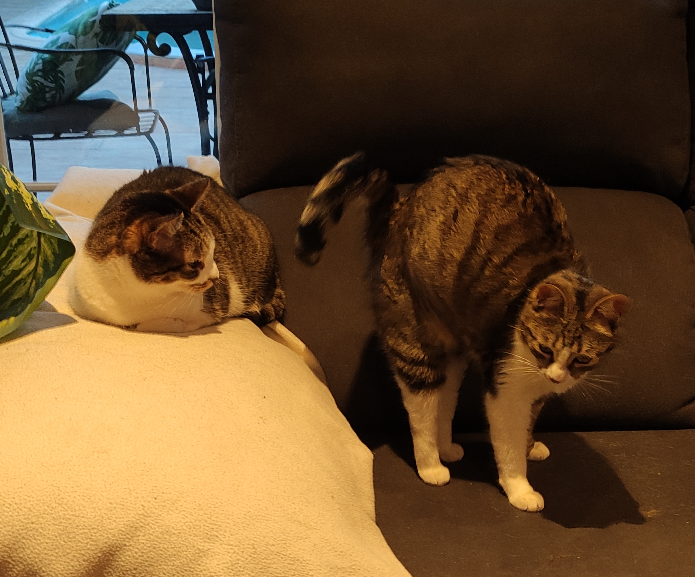

# Bienvenido/a a mi repositorio de GitHub

### ¡Hola! Soy Secallona, también puedes encontrarme en distintas redes como cayusob o simplemente Carlos, un estudiante de primer año de programación. Este es mi repositorio personal donde compartiré mis proyectos y ejercicios relacionados con los lenguajes de programación que vaya aprendiendo, de momento contamos con estos🤓: Java, HTML, CSS, y BASH. 🚀

## Sobre mí

### Nombre: Carlos Ayuso
### Estudiante de: Desarrollo de Aplicacones Multiplataforma (DAM)
### Lenguajes de programación: Java, HTML, CSS, BASH

# Objetivo

### Aunque aún estoy en las etapas iniciales, estoy emocionado de aprender y mejorar mis habilidades. 
### En este perfil subiré contenido de mis clases, ejercicios así como algún que otro proyecto personal.
### Espero en un futuro próximo poder participar en proyectos de codigo abierto de todo el mundo y aportar mi granito de arena💡

# Contacto

### Si necesitas contactarme o simplemente quieres charlar, no dudes en contactarme:

### Email 📧: 
    cayusob@gmail.com 
### Twitter🐦 :
    @ayayayuso 

¡Gracias por visitar mi repositorio! ¡Vuelve pronto para ver actualizaciones! 👋

